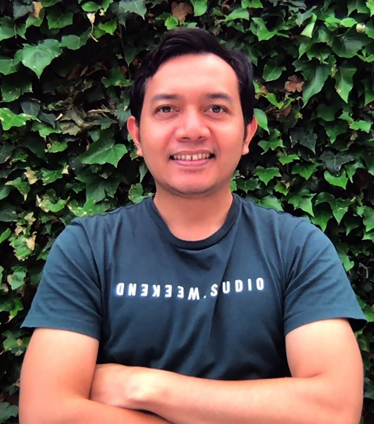

# 2. Halo, saya Eka

**Lebih lengkapnya Eka Putra, asal Kabupaten Gianyar. Sebuah Kabupaten yang terkenal sebagai pusatnya seni kerajinan di Bali.**

Kalau dilihat dari latar belakang, saya dan keluarga bisa dibilang biasa-biasa saja. Bapak dan ibu saya adalah pengrajin kayu dengan penghasilan yang tidak seberapa, tetapi cukup untuk makan sehari-hari.

Saya anak pertama dari tiga bersaudara, tipe anak rumahan, agak kuper alias kurang pergaulan, mungkin istilah masa kininya adalah introvert. Tidak banyak teman, tetapi ketika punya teman baik maka akan saya anggap saudara sendiri.

Belakangan ini, saya membranding diri sebagai seorang lulusan SMA yang berhasil menjadi programmer. Bahwa saya bisa mendapatkan pekerjaan sebagai programmer meskipun dengan latar belakang seadanya, tanpa kursus, sekolah, ataupun kuliah di bidang IT.

Terus apanya yang spesial? Kan banyak anak SMA yang jago coding. Awalnya saya juga berpikir seperti itu, namun ketika bercerita bahwa saya bekerja sebagai programmer bahkan sampai ke luar negeri, baru kemudian banyak yang bereaksi. Banyak yang bertanya, kok bisa? bagaimana caranya?

Di sana saya menyadari bahwa ada yang unik dalam kasus saya. Banyak yang tidak menyangka bahwa hal tersebut bisa terjadi mengingat latar belakang dan tingkat pendidikan saya.

Yang beruntung seperti saya mungkin banyak. Tapi tidak banyak yang mau membagikan ceritanya untuk menginspirasi orang lain, dan di sini saya memberanikan diri untuk itu.

<figure><figcaption>
It's me 🙂
</figcaption></figure>

* [https://id.wikipedia.org/wiki/Kabupaten\_Gianyar](https://id.wikipedia.org/wiki/Kabupaten\_Gianyar)
