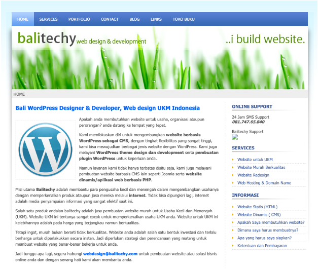

# 4.7 WordPress

**Sembari terus mengasah kemampuan HTML dan CSS, munculah sebuah pertanyaan. Apabila saya perlu membuat 100 halaman web dengan desain yang sama tapi memiliki isi yang berbeda, bukankah sangat repot kalau harus membuat 100 file HTML?**

Disana saya mulai belajar konsep baru yang bernama website dinamis. Dalam website yang dinamis, isi dari tiap halaman kita simpan secara terpisah. Tempat penyimpanan yang paling umum untuk isi website adalah di database.

Dengan begitu, kita hanya perlu membuat satu halaman saja yang isinya bisa berubah sesuai dengan URL yang diakses pengguna.

Di sini saya tidak akan menjelaskannya secara detail, karena buku ini bukanlah tentang cara membuat website. Meskipun begitu, mudah-mudahan kamu sudah ada sedikit bayangan.

Untuk membuat website yang dinamis, saya perlu belajar yang namanya bahasa pemrograman server. Bahasa yang nantinya akan berjalan di server, sebuah server dimana file website yang sudah kita buat akan kita tempatkan.

Bahasa pemrograman server yang paling populer saat itu adalah PHP. Buat yang belum tahu, kamu bisa cari referensi mengenai PHP di internet.

Karena sudah punya pengalaman dengan Delphi dan sedikit Javascript, maka proses belajar PHP ini terasa lebih mudah. Tinggal sesuaikan dengan konsep, sintak, dan aturan-aturan yang berlaku di PHP.

Tidak lama berselang, saya menemukan cara yang lebih mudah untuk membuat website. Cara yang tidak mengharuskan saya menjadi ahli PHP. Dia adalah CMS, yang merupakan singkatan dari _Content Management System_.

CMS adalah sebuah software berbasis web yang bisa kita gunakan untuk membuat website tanpa banyak coding. CMS sudah menyediakan banyak hal seperti koneksi database, autentikasi, sistem template, dan masih banyak lagi.

Buat saya, CMS adalah sebuah game changer di dunia web development. Membuat kita bisa fokus ke hal yang lebih penting yaitu konten dan tampilan website. Hasilnya, kita bisa membuat website dengan lebih cepat dibandingkan harus coding dari nol.

Disanalah saya mulai melihat peluang baru terbuka di depan mata. Langsung terbersit dalam pikiran bahwa saya bisa sangat kaya kalau jago menggunakan CMS ini.

Akhirnya saya memutuskan untuk belajar CMS yang populer saat itu yaitu WordPress. WordPress adalah CMS dengan kode sumber terbuka alias open source yang bisa kita gunakan secara gratis.

Setelah beberapa minggu belajar WordPress sambil mengintegrasikan desain yang saya buat sendiri, jadilah website saya yang pertama. Saya belikan sebuah domain dengan nama _balitechy.com_.

Bali karena saya dari Bali, dan Techy karena saya suka teknologi. Nama yang keren kan? :D

Di bawah ini adalah tampilan website pertama yang saya buat dengan WordPress:

<figure><figcaption>
https://balitechy.com (tidak aktif)
</figcaption></figure>

Jadi terlihat kan, perkembangan skill saya terbilang cepat. Yang awalnya hanya bermain dengan HTML dan CSS, tidak lama kemudian saya sudah bermain dengan WordPress.

Itulah manfaatnya kita punya pengalaman berbeda, meskipun pengalaman sebelumnya tidak terkait langsung dengan pembuatan website. Tapi tidak bisa dipungkiri bahwa skill desain yang saya miliki berperan besar di sana. Skill programming yang saya dapatkan ketika bermain virus-virusan juga sangat berguna.

Dan yang lebih penting adalah, saat itu saya tidak _overthinking_. Tidak sempat memikirkan bahasa apa yang keren atau framework mana yang lagi rame. Hanya fokus belajar apa yang ingin saya pelajari.

Namun banyak calon programmer saat ini malah sebaliknya, overthinking bahkan sebelum memulai. Pusing memilih bahasa terbaik, bingung memilih framework, khawatir dengan umur yang sudah tidak muda lagi, bahkan sebelum memulai.

* [https://www.php.net/](https://www.php.net/)
* [https://wordpress.org/](https://wordpress.org/)
